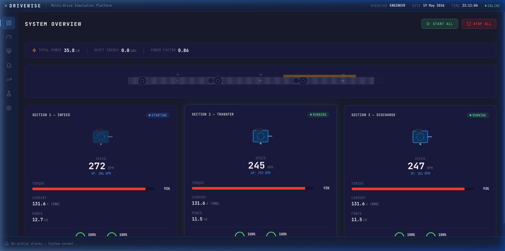
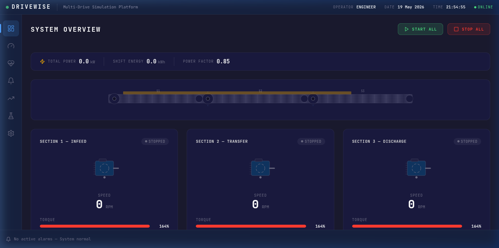
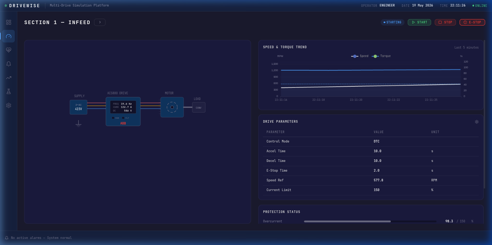
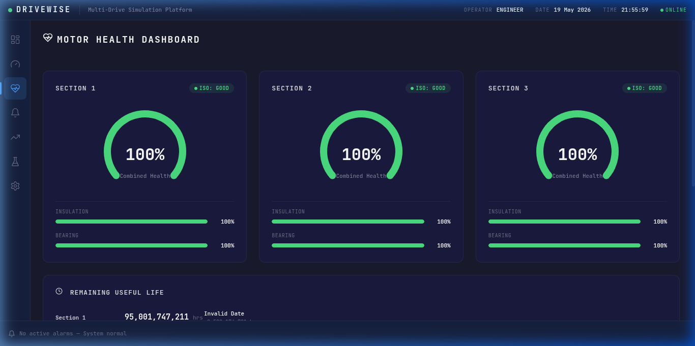
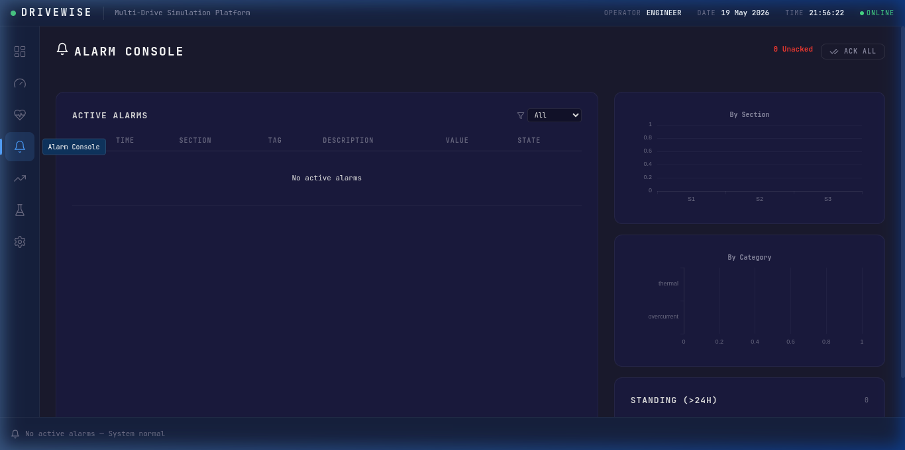
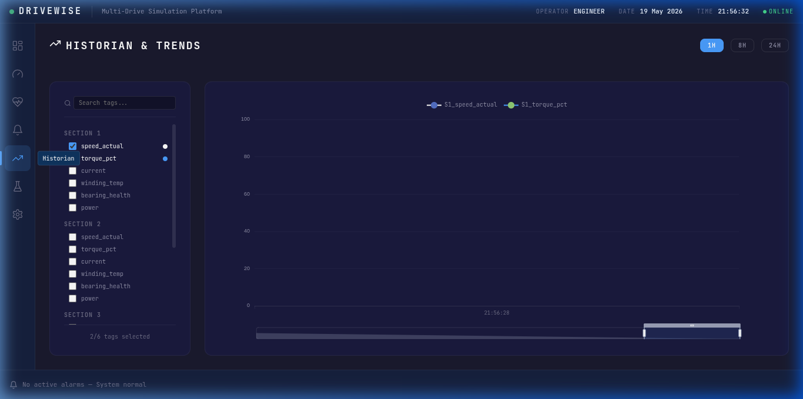
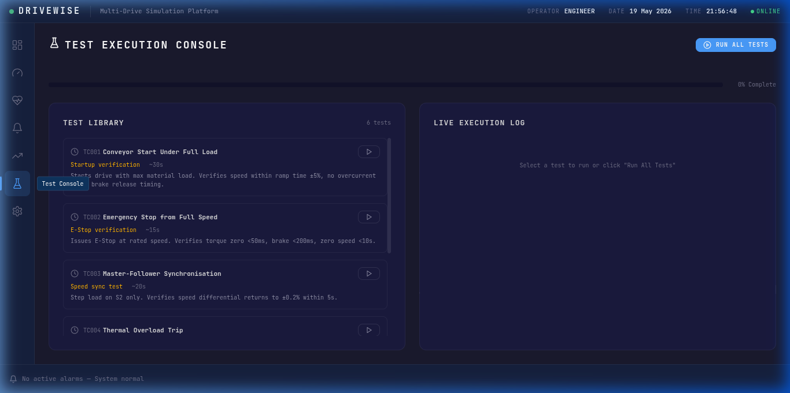
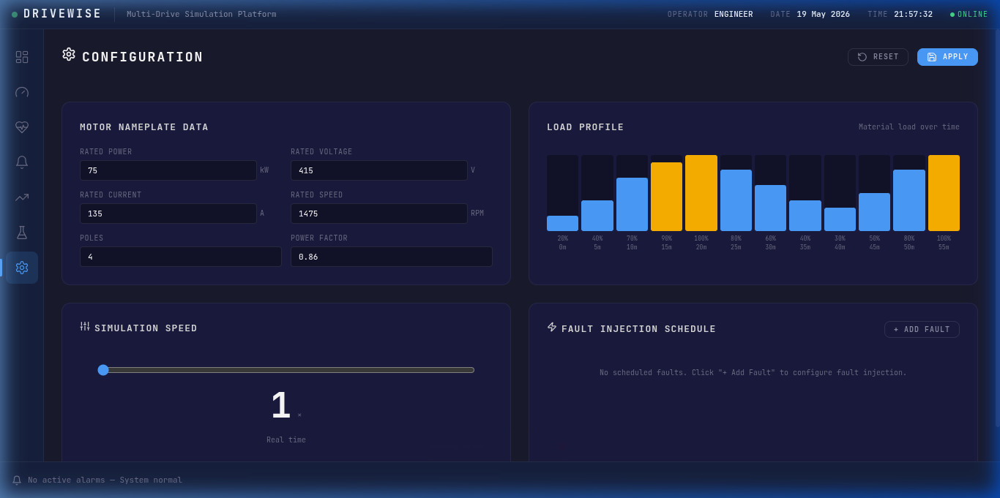

# DRIVEWISE -- Multi-Drive Industrial Simulation and Validation Platform

DRIVEWISE is a high-fidelity digital-twin simulation of three coordinated ABB ACS880 variable frequency drives controlling a bulk material conveyor system. It features a complete ISA-101 compliant SCADA HMI, an automated Factory Acceptance Test engine, predictive maintenance analytics, and real-time physics simulation -- built as a virtual commissioning environment for industrial drive system validation.

---

## Table of Contents

- [Overview](#overview)
- [Screenshots](#screenshots)
- [Architecture](#architecture)
- [Technology Stack](#technology-stack)
- [Features](#features)
- [Getting Started](#getting-started)
- [Automated Test Suite](#automated-test-suite)
- [Project Structure](#project-structure)
- [Standards and References](#standards-and-references)
- [License](#license)

---

## Overview

Most drive simulations model a single motor with a speed slider. DRIVEWISE simulates what ABB actually deploys in the field -- a coordinated multi-drive conveyor system where three ACS880 drives work together on a shared mechanical load. The platform implements:

- ABB's patented Direct Torque Control (DTC) algorithm with sub-millisecond torque response
- Dual-node motor thermal dynamics with Arrhenius insulation degradation modeling
- Conveyor belt physics with inertia, friction, variable material load, and belt slip detection
- Bearing vibration diagnostics with ISO 10816 severity classification
- Five IEC-compliant electrical protection functions
- Master-follower speed coordination with fault cascade logic
- A 6-test automated FAT engine with PDF report generation

---

## Screenshots

### System Overview

Three drive sections displayed simultaneously with live speed, torque, current, power readings, animated conveyor belt mimic with material flow, and real-time energy monitoring panel.





### Drive Detail View

Single-line diagram mimic showing supply, ACS880 drive cabinet, motor, and conveyor load. Includes real-time speed and torque trending via Apache ECharts, drive parameter table with inline editing, and protection status bars.



### Motor Health Dashboard

Predictive maintenance screen with radial health gauges per motor section (combined insulation and bearing health score), remaining useful life predictions in operating hours, and ISO 10816 vibration severity classification.



### Alarm Console

ISA-18.2 compliant alarm management with active alarm list, priority filtering, alarm distribution analysis by section and category, standing alarm tracking, and bulk acknowledge controls.



### Historian and Trends

Multi-tag trend viewer with searchable tag selector, configurable time ranges, real-time ECharts rendering at 10 Hz update rate, and minimap navigation for historical data browsing.



### Test Execution Console

Automated FAT test library with 6 test cases, live execution log with timestamped pass/fail assertions, per-test progress tracking, overall completion bar, and PDF report generation.



### Configuration Panel

Motor nameplate editor, interactive load profile bars, simulation speed multiplier (1x to 60x), and fault injection schedule builder -- all live-apply via WebSocket to the running simulation.



---

## Architecture

The platform follows a three-tier industrial architecture that mirrors real-world SCADA deployment patterns:

```
+---------------------------------------------------------------+
|                       REACT HMI (Vite)                        |
|                                                               |
|   Top Bar | Nav Sidebar | 7 ISA-101 Screens | Alarm Banner   |
|                                                               |
|   Apache ECharts -- canvas-rendered industrial charting        |
+-------------------------------+-------------------------------+
                                |
                    WebSocket (100ms tag updates, ws://8765)
                                |
+-------------------------------v-------------------------------+
|                  PYTHON SIMULATION BACKEND                    |
|                                                               |
|   +-------------+  +--------------+  +-------------------+   |
|   | Drive Model |  | Motor Model  |  | Conveyor Dynamics |   |
|   | (DTC + V/f) |  | (Thermal 2N) |  | (Inertia + Slip)  |   |
|   +-------------+  +--------------+  +-------------------+   |
|                                                               |
|   +-------------+  +--------------+  +-------------------+   |
|   | Bearing FFT |  | Protection   |  | Alarm Manager     |   |
|   | (Vibration) |  | (5x IEC)     |  | (ISA-18.2)        |   |
|   +-------------+  +--------------+  +-------------------+   |
|                                                               |
|   +-------------+  +--------------+  +-------------------+   |
|   | Fault       |  | FAT Test     |  | PDF Report Gen    |   |
|   | Injector    |  | Engine       |  | (ReportLab)       |   |
|   +-------------+  +--------------+  +-------------------+   |
|                                                               |
|   Coordinator: 3 Units x 4 Models + 5 Protections            |
+---------------------------------------------------------------+
```

**Level 1 (Physics Engine):** Python 3.12 async simulation running 12 model instances (3 units x 4 models each) with coordinated master-follower logic and 5 protection functions.

**Level 2 (Communication):** WebSocket bridge on port 8765 broadcasts a JSON tag snapshot every 100ms. A bidirectional command channel handles start/stop, parameter changes, fault injection, and test execution.

**Level 3 (HMI):** React 18 single-page application with 7 ISA-101 compliant screens, Apache ECharts for industrial trending, and real-time WebSocket subscription.

---

## Technology Stack

| Layer           | Technology                          | Purpose                                       |
|-----------------|-------------------------------------|-----------------------------------------------|
| Frontend        | React 18 + Vite 5                   | Component-based ISA-101 HMI                   |
| Charting        | Apache ECharts                      | Canvas-rendered, industrial-grade trending     |
| Backend         | Python 3.12 (asyncio)               | Physics simulation engine                      |
| Numerics        | NumPy                               | ODE integration, FFT spectrum generation       |
| Communication   | WebSocket (websockets lib)          | 10 Hz bidirectional real-time tag streaming     |
| Reports         | ReportLab                           | PDF FAT report generation                      |
| Design System   | ISA-101 dark palette, monospace     | Industrial HMI standard compliance             |
| Icons           | Lucide React                        | Consistent icon system                         |

---

## Features

### Physics Simulation

- **Direct Torque Control (DTC)** -- ABB's patented control algorithm with +/-0.1% speed accuracy and sub-millisecond torque step response
- **Scalar V/f Mode** -- Basic voltage-to-frequency ratio control for simple applications
- **S-Curve Ramp Generator** -- Configurable acceleration, deceleration, and emergency stop with jerk limiting
- **Dual-Node Thermal Model** -- Independent stator winding and rotor temperature tracking with speed-dependent cooling
- **Arrhenius Insulation Life** -- Cumulative thermal stress degradation following the industrial standard aging equation
- **Conveyor Belt Dynamics** -- Newton's rotational dynamics with variable material load and belt slip detection
- **Bearing Vibration Spectrum** -- Synthetic FFT with BPFO, BPFI, and BSF defect frequency injection

### Protection Functions

1. **Overcurrent** -- IEC 60255 inverse-time characteristic (150% trips in ~60s, 300% in ~5s)
2. **Overvoltage** -- DC bus monitoring during regenerative braking
3. **Undervoltage** -- Supply dip detection with ride-through vs. trip logic
4. **Earth Fault** -- Residual current imbalance detection
5. **Thermal Overload** -- Cumulative thermal model trip (distinct from instantaneous overcurrent)

### HMI Screens

1. **System Overview** -- 3 drive cards, animated conveyor belt, energy panel
2. **Drive Detail** -- Animated single-line diagram, ECharts trending, parameter editor, protection bars
3. **Motor Health** -- Radial health gauges, insulation/bearing breakdown, RUL predictions
4. **Alarm Console** -- ISA-18.2 alarm lifecycle, distribution analytics, standing alarm tracking
5. **Historian** -- Multi-tag selector, time-range zoom, 10 Hz live streaming
6. **Test Console** -- 6 FAT tests, live execution log, PDF report generation
7. **Configuration** -- Motor nameplate, load profile, simulation speed, fault injection schedule

### Predictive Maintenance

- Insulation health tracking via Arrhenius thermal degradation
- Bearing health from vibration spectrum analysis with ISO 10816 classification
- Combined Remaining Useful Life (RUL) expressed in operating hours
- Mirrors ABB Ability Smart Sensor commercial product functionality

---

## Getting Started

### Prerequisites

- Node.js 18+ and npm
- Python 3.12+
- Python packages: `websockets`, `numpy`, `reportlab`

### Installation

```bash
# Clone the repository
git clone https://github.com/GrimDocDimes/DRIVEWISE.git
cd DRIVEWISE

# Install frontend dependencies
npm install

# Install Python dependencies
pip install websockets numpy reportlab
```

### Running the Platform

The platform requires two processes running simultaneously:

```bash
# Terminal 1 -- Start the Python simulation engine
python3 backend/main.py

# Terminal 2 -- Start the React HMI development server
npm run dev
```

The HMI will be available at `http://localhost:5173` and will connect to the simulation engine on `ws://localhost:8765`.

### NixOS Users

A `shell.nix` is provided for reproducible development:

```bash
nix-shell
npm install
python3 backend/main.py &
npm run dev
```

---

## Automated Test Suite

DRIVEWISE includes a 6-test Factory Acceptance Test engine that executes without human intervention. Each test resets the simulator, applies specific conditions, runs the physics, and evaluates assertions against IEC-referenced pass criteria.

| Test ID | Name                         | Pass Criteria                                                   |
|---------|------------------------------|-----------------------------------------------------------------|
| TC001   | Start Under Full Load        | Speed within +/-5% of ramp time, no overcurrent trip            |
| TC002   | E-Stop from Full Speed       | Torque zero in less than 50ms, speed zero in less than 10s      |
| TC003   | Master-Follower Sync         | Speed differential below 2% within 5s of disturbance            |
| TC004   | Thermal Overload Trip        | Temperature rise detected, thermal tracking active              |
| TC005   | Power Dip Ride-Through       | 80% dip: ride-through; 65% dip: correct trip                   |
| TC006   | Fault Cascade Response       | S1 fault triggers S2 and S3 stop within 500ms                  |

Upon completion, a PDF FAT Report is auto-generated with a cover page, executive summary, per-test assertion tables, timestamped execution logs, and a sign-off page.

---

## Project Structure

```
DRIVEWISE/
|-- backend/
|   |-- main.py                 # Async simulation engine entry point
|   |-- report_gen.py           # PDF FAT report generator (ReportLab)
|   +-- models/                 # Physics model modules
|-- src/
|   |-- App.jsx                 # Main application shell and routing
|   |-- main.jsx                # React entry point
|   |-- index.css               # ISA-101 design system and global styles
|   |-- screens/                # 7 HMI screen components
|   +-- contexts/               # React context providers (WebSocket, state)
|-- submission/
|   |-- main.tex                # LaTeX project submission document
|   |-- main.pdf                # Compiled submission PDF
|   +-- figures/                # HMI screenshots used in the submission
|-- screenshots/                # README screenshots
|-- index.html                  # Vite HTML entry
|-- vite.config.js              # Vite build configuration
|-- package.json                # Node.js dependencies
|-- shell.nix                   # NixOS reproducible development shell
+-- FAT_Report.pdf              # Example generated FAT report
```

---

## Standards and References

| Standard    | Application in DRIVEWISE                                          |
|-------------|-------------------------------------------------------------------|
| IEC 60255   | Inverse-time overcurrent protection characteristics (Curve B)     |
| IEC 61131-3 | PLC sequencing logic, permissive checks, fault cascade rules      |
| IEC 60034   | Motor nameplate rating and thermal class specification            |
| IEC 60204   | Machine safety and emergency stop requirements                    |
| IEC 61000   | Power quality, voltage dip ride-through testing                   |
| ISA-18.2    | Alarm management lifecycle states and flood detection             |
| ISA-101     | High-performance HMI design -- colour communicates abnormality    |
| ISO 10816   | Vibration severity classification for rotating machinery          |

---

## License

This project was developed for the ABB Industrial Hackathon 2026.
